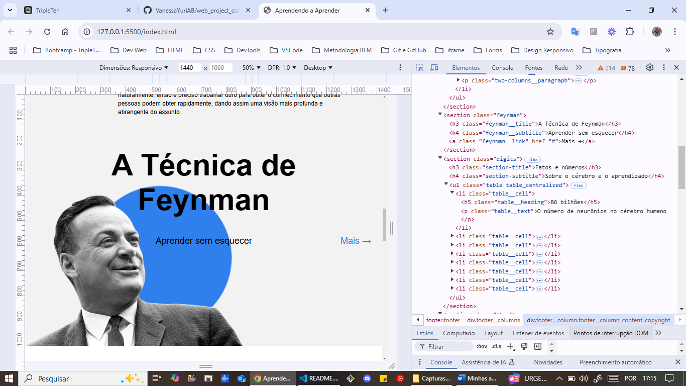

# APRENDENDO A APRENDER

Este é um projeto adicional do sprint 3 e 4 do bootcamp de desenvolvimento web da Triple Ten.

Um site de página única usando HTML e CSS avançados, onde o foco está no layout do flexbox, posicionamento de elementos, HTML semântico, Google fonts, pseudoclasse, iframes, animação em css, formulário e BEM flat.

Feito com roteiro com bastante instruções, mas não todas, para cada bloco. Com código inicial do HTML para as seções principais da página e alguns estilos para começar.

(: It was a nice challenge! :)

# RECURSOS DO PROJETO

- HTML semântico
  
  
  
  
  

- Flexbox
  
  
  

- Posicionamento
  
  
  

- Google fonts
  
  

- Pseudoclasse
  

- iframe
  

- Animação CSS
  
  
  

- Formulário
  

- BEM flat
  
  
  
  
  
  
  

# PLANOS PARA FINALIZAÇÃO DO PROJETO

- Adicionar meus vídeos educativos favoritos.
- Verificar o código para compatibilidade cruzada e adicionar todos os prefixos de fornecedores necessários.
